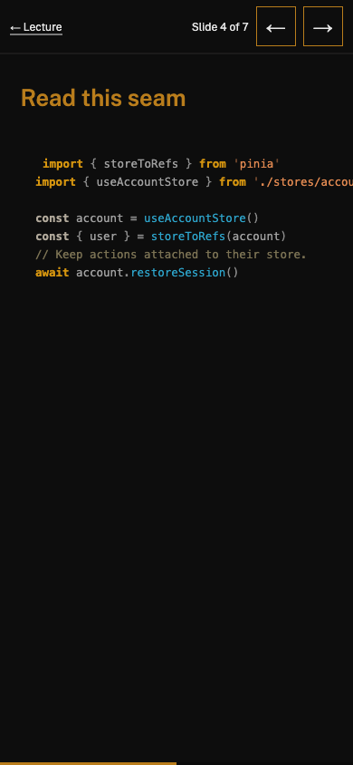
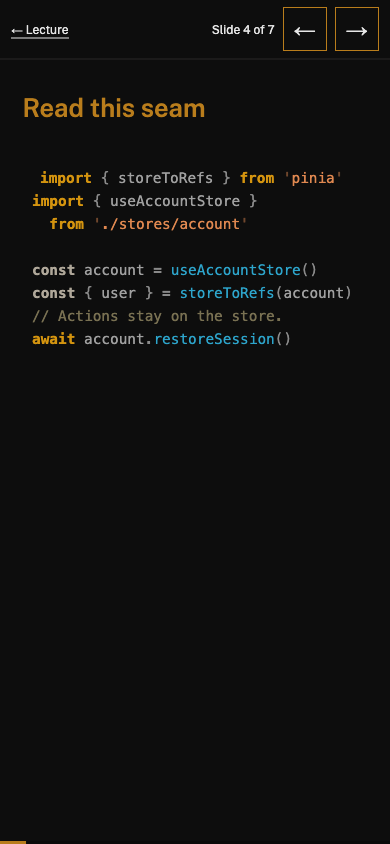

# Prospective-student review

Reviewed on 9 September 2026 using Chrome 152.0.7977.83 and the production preview at port 4322. The homepage and deck HTML served by the preview were byte-compared with `dist/`. The dev server remains on port 4321 under the repository base path.

## Scope and results

| Review | Evidence | Result |
| --- | --- | --- |
| All 48 content/deck URLs at 390×844 | [Phone report](evidence/phone-pages.json) | No page overflow, missing h1 or console error |
| The same URLs at 1920×1080 | [Desktop report](evidence/desktop-pages.json) | No page overflow, missing h1 or console error |
| 84 slides at both sizes | [Slide report](evidence/slides.json) | All 168 combinations passed geometry, current-label and final-button checks |
| Focused Next button | [Keyboard report](evidence/keyboard.json) | Space advances 4→5; Enter advances 5→6 |
| Navigation and degraded execution | [Interaction report](evidence/interactions.json) | Mobile menu, search, no-JS reading, theme toggle and mid-slide resize passed |

The built 404 page is additional to those 48 URLs. The build's accessibility and link checks cover all 49 HTML pages.

## What was read, rather than merely measured

Home → week 2 → week 6 → week 9 → week 12 → Assignment 2 → its lecture deck → policies. Assessment 1 and 3, the week 8 migration comparison, the overview and fixture resources were also reviewed for the semester's progression.

Week 2's stable article identity becomes week 6's shareable URL and week 9's editable record. Week 12 transfers the ownership question to state transitions. The projects use different interfaces, but the criterion remains an explainable boundary. Assignment 2 explicitly excludes TypeScript so the week 10 transition does not change its contract. The capstone has completion time after the final teaching studio. Every required tool has a visible teaching link.

The code excerpts are deliberately partial teaching seams, labelled as such in the lectures. Fixtures are downloadable and tested; they are not advertised as a complete backend. The teaching role and consultation domain are explicitly fictional.

## A failure the build could not see

The phone deck's code block was 399.6px wide at a 390px viewport. Its CSS width was 100%, but padding was outside that width. The fixed version uses border-box sizing and keyboard-focusable code, with short source lines for phone reading. The presentation engine is unchanged.

After shortening the teaching excerpts, all 24 affected code-slide/viewport combinations were checked again: [code-slide report](evidence/code-slides.json).

The first slide audit also measured before the hash-change event settled. It was corrected to wait for the visible section and counter to agree; the geometry threshold was not relaxed. A fresh reload is required when returning to the same deck with a different hash after rebuilding, because hash-only navigation can preserve the old document.

## Repeating the review

Run `pnpm check`, start `pnpm preview --port 4322`, and read the printed port. In Chrome, set the exact viewports above. Start from the home page, use the mobile menu to reach Twelve weeks, search for Pinia, open the lecture, and follow its deck link. Step through all seven slides; focus Next and use Space and Enter once each. Resize on slide 4 and verify it stays on slide 4. Repeat the main reading path with JavaScript disabled. Check console messages after the interactions.

No public deployment is claimed: the repository was private and the Pages endpoint returned 404 when inspected. Pushing and publication are reserved for the student by the repository instructions.

## UI redesign review — 9 September 2026

The redesign kept the course content and routes, then changed the shared reading system. Slop gold remains the institutional colour; Vue green now carries curriculum phase, ownership paths and primary actions. The homepage architecture diagram uses actual Vue and TypeScript marks, while the weekly, studio and assessment indexes use purpose-specific icons and progression structures instead of the same card repeated everywhere.

A browser pass found the assessment composition was still constrained by the generic 72-character prose measure. At desktop this made the intended asymmetric layout occupy only half the available content width. The assessment and studio grids now opt out explicitly; their prose keeps its own readable line length. A second inspection found CSS-generated `/` characters in accessible heading names such as `/Scope`. The decorative character was replaced with a border so the visible hierarchy remains but the heading name is unchanged.

The fresh route sweep visited all 48 authored routes at 390×844 and 1920×1080: 96 combinations with no document overflow, console errors, failed responses or missing main/deck surface. Targeted screenshots covered the homepage, curriculum map, week 9 lecture, assessment overview, Assignment 2 and week 9 deck. The mobile menu expanded, the search dialog opened, and the actual theme control produced a readable dark homepage. In the deck toolbar, one Next click changed slide 1 to 2 and one focused Space activation changed slide 2 to 3, confirming one action per input after the visual changes.
